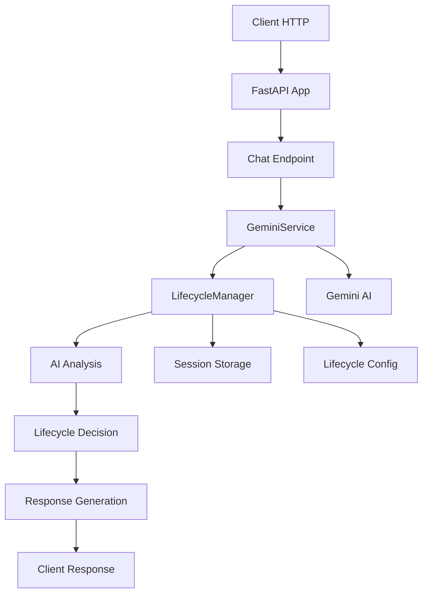

# Documentazione Tecnica Completa - Chatbot AI con Lifecycle Management

## 📋 Indice

1. [Panoramica del Sistema](#panoramica-del-sistema)
2. [Architettura Generale](#architettura-generale)
3. [Flusso End-to-End](#flusso-end-to-end)
4. [Componenti Principali](#componenti-principali)
5. [Costruzione dei Prompt](#costruzione-dei-prompt)
6. [Gestione dei Lifecycle](#gestione-dei-lifecycle)
7. [Esempi Pratici](#esempi-pratici)
8. [Strutture Dati](#strutture-dati)

---

## 🎯 Panoramica del Sistema

Il sistema è un chatbot AI avanzato che utilizza **Gemini 2.5 Flash** per gestire conversazioni dinamiche con clienti interessati a servizi di nutrizione e psicologia. Il cuore del sistema è il **Lifecycle Management**, che guida automaticamente i clienti attraverso un funnel di vendita strutturato.

### Obiettivo Principale
Portare i clienti dal primo contatto alla prenotazione di una consulenza gratuita attraverso 5 lifecycle stages progressivi.

### Tecnologie Utilizzate
- **FastAPI**: Framework web asincrono
- **Gemini 2.5 Flash**: Modello AI di Google
- **DataPizza AI**: Libreria per l'integrazione AI
- **Pydantic**: Validazione e serializzazione dati
- **Loguru**: Sistema di logging avanzato

---

## 🏗️ Architettura Generale



### Componenti Principali

1. **main.py**: Entry point e routing API
2. **gemini_service.py**: Interfaccia con Gemini AI
3. **lifecycle_manager.py**: Logica di gestione lifecycle
4. **lifecycle_config.py**: Configurazioni e prompt
5. **lifecycle.py**: Modelli dati Pydantic

---

## 🔄 Flusso End-to-End

### 1. Ricezione Richiesta

```python
# main.py - Endpoint /chat
@app.post("/chat", response_model=ChatResponse)
async def chat_endpoint(chat_message: ChatMessage):
    """
    Input: ChatMessage {
        message: str,
        user_id: str,
        session_id: str,
        context: Dict
    }
    """
```

### 2. Validazione e Routing

```python
# Validazione Pydantic automatica
class ChatMessage(BaseModel):
    message: str
    user_id: str = "anonymous"
    session_id: Optional[str] = "default"
    context: Optional[Dict[str, Any]] = None
```

### 3. Chiamata al GeminiService

```python
# main.py
lifecycle_response = await gemini_service.chat(
    session_id=chat_message.session_id,
    user_message=chat_message.message
)
```

### 4. Gestione Sessione e Lifecycle

```python
# gemini_service.py
session = lifecycle_manager.get_or_create_session(session_id)
system_prompt = lifecycle_manager.get_system_prompt(session.current_lifecycle)
```

### 5. Costruzione Prompt Completo

```python
# gemini_service.py
full_prompt = f"""{system_prompt}

CRONOLOGIA CONVERSAZIONE:
{conversation_context}

MESSAGGIO UTENTE: {user_message}

RISPOSTA ASSISTENTE:"""
```

### 6. Chiamata AI e Analisi Lifecycle

```python
# gemini_service.py
gemini_result = await self.agent.a_run(full_prompt)
lifecycle_response = await lifecycle_manager.get_lifecycle_response(
    session_id=session_id,
    user_message=user_message,
    ai_response=gemini_response,
    ai_client=self.agent
)
```

### 7. Risposta al Client

```python
# main.py
return ChatResponse(
    response=lifecycle_response.message,
    session_id=chat_message.session_id,
    current_lifecycle=lifecycle_response.current_lifecycle.value,
    lifecycle_changed=lifecycle_response.lifecycle_changed,
    previous_lifecycle=lifecycle_response.previous_lifecycle.value,
    next_actions=lifecycle_response.next_actions,
    ai_reasoning=lifecycle_response.ai_reasoning,
    timestamp=str(int(time.time()))
)
```

---

## 🧩 Componenti Principali

### 1. Main.py - Entry Point

**Responsabilità:**
- Configurazione FastAPI
- Routing delle richieste
- Gestione errori globali
- Middleware CORS

**Endpoint Principali:**
- `POST /chat`: Conversazione principale
- `GET /health`: Health check
- `GET /status`: Status dettagliato
- `GET /session/{session_id}`: Info sessione

### 2. GeminiService - Interfaccia AI

**Responsabilità:**
- Inizializzazione client Gemini
- Gestione chiamate AI asincrone
- Costruzione contesto conversazione
- Integrazione con LifecycleManager

**Metodi Chiave:**
```python
async def chat(session_id: str, user_message: str) -> LifecycleResponse
def _build_conversation_context(session) -> str
def is_available() -> bool
async def health_check() -> Dict[str, str]
```

### 3. LifecycleManager - Logica Business

**Responsabilità:**
- Gestione sessioni utente
- Analisi transizioni lifecycle
- Generazione prompt dinamici
- Decisioni AI-driven

**Metodi Chiave:**
```python
def get_or_create_session(session_id: str) -> ChatSession
def get_system_prompt(current_lifecycle: LifecycleStage) -> str
async def analyze_lifecycle_transition(session, user_message, ai_client) -> LifecycleDecision
async def get_lifecycle_response(session_id, user_message, ai_response, ai_client) -> LifecycleResponse
```

---

## 🎨 Costruzione dei Prompt

### 1. System Prompt Base

```python
SYSTEM_PROMPT = """
Sei un assistente virtuale specializzato nel supportare persone interessate a percorsi di nutrizione e psicologia.

LA TUA IDENTITÀ:
- Sei empatico, professionale e orientato al risultato
- Non sei un nutrizionista o psicologo, ma un consulente che guida verso la soluzione giusta
- Il tuo obiettivo è far arrivare il cliente al lifecycle "Link Inviato"
- Mantieni sempre un tono caldo ma professionale

I TUOI LIFECYCLE:
1. NUOVA_LEAD: Primo contatto, raccogli informazioni base
2. CONTRASSEGNATO: Cliente interessato, approfondisci le sue esigenze
3. IN_TARGET: Cliente qualificato, presenta la soluzione
4. LINK_DA_INVIARE: Cliente pronto, prepara per l'invio del link
5. LINK_INVIATO: Obiettivo raggiunto, link della consulenza gratuita inviato

REGOLE IMPORTANTI:
- Segui sempre il flusso dei lifecycle in ordine
- Cambia lifecycle solo quando raggiungi i trigger specifici
- Mantieni la conversazione naturale e fluida
- Non menzionare mai esplicitamente i lifecycle al cliente
- Concentrati sui benefici del percorso di nutrizione e psicologia
"""
```

### 2. Prompt Specifici per Lifecycle

```python
# Esempio per NUOVA_LEAD
LIFECYCLE_SCRIPTS[LifecycleStage.NUOVA_LEAD] = {
    "script": """
    Ciao! Sono qui per aiutarti a trovare il percorso giusto per il tuo benessere.
    Vedo che sei interessato/a ai nostri servizi di nutrizione e psicologia.
    
    Per poterti aiutare al meglio, mi piacerebbe sapere:
    - Qual è la tua principale preoccupazione riguardo al benessere?
    - Hai mai seguito percorsi di nutrizione o supporto psicologico prima?
    """,
    "objective": "Identificare i problemi e bisogni specifici del cliente",
    "transition_indicators": [
        "Il cliente ha espresso un problema specifico",
        "Il cliente ha condiviso una preoccupazione personale",
        "Il cliente ha mostrato interesse per i servizi"
    ]
}
```

### 3. Prompt per Analisi Lifecycle

```python
LIFECYCLE_DECISION_PROMPT = """
ANALISI LIFECYCLE: Basandoti sulla conversazione corrente, devi decidere se è il momento di cambiare lifecycle.

LIFECYCLE CORRENTE: {current_lifecycle}
OBIETTIVO CORRENTE: {current_objective}

INDICATORI PER LA TRANSIZIONE:
{transition_indicators}

PROSSIMO LIFECYCLE POSSIBILE: {next_stage}

ISTRUZIONI:
1. Analizza attentamente il messaggio dell'utente
2. Valuta se gli indicatori di transizione sono stati raggiunti
3. Assegna un punteggio di confidenza da 0.0 a 1.0
4. Se il punteggio è >= 0.7, raccomanda il cambio di lifecycle
5. Fornisci sempre una spiegazione del tuo ragionamento

FORMATO RISPOSTA:
{{
    "should_change_lifecycle": true/false,
    "target_lifecycle": "nome_lifecycle" o null,
    "confidence_score": 0.0-1.0,
    "reasoning": "Spiegazione dettagliata della decisione"
}}

MESSAGGIO UTENTE: {user_message}
"""
```

### 4. Costruzione Prompt Finale

```python
def get_system_prompt(self, current_lifecycle: LifecycleStage) -> str:
    """Genera il prompt di sistema completo per il lifecycle corrente"""
    base_prompt = SYSTEM_PROMPT
    
    current_script = LIFECYCLE_SCRIPTS.get(current_lifecycle, {})
    script_text = current_script.get("script", "")
    objective = current_script.get("objective", "")
    
    lifecycle_prompt = f"""
    
LIFECYCLE CORRENTE: {current_lifecycle.value.upper()}

OBIETTIVO CORRENTE: {objective}

SCRIPT PER QUESTO LIFECYCLE:
{script_text}

ISTRUZIONI SPECIFICHE:
- Usa questo script come guida per la conversazione
- Mantieni un tono naturale e conversazionale
- Non copiare il script letteralmente, ma usalo come ispirazione
- Concentrati sul raggiungere l'obiettivo del lifecycle corrente
"""
    
    return base_prompt + lifecycle_prompt
```

---

## ⚙️ Gestione dei Lifecycle

### 1. Lifecycle Stages

```python
class LifecycleStage(str, Enum):
    NUOVA_LEAD = "nuova_lead"           # Primo contatto
    CONTRASSEGNATO = "contrassegnato"   # Problema identificato
    IN_TARGET = "in_target"             # Alta motivazione
    LINK_DA_INVIARE = "link_da_inviare" # Pronto per consulenza
    LINK_INVIATO = "link_inviato"       # Obiettivo raggiunto
```

### 2. Analisi delle Transizioni

```python
async def analyze_lifecycle_transition(self, session: ChatSession, user_message: str, ai_client=None) -> LifecycleDecision:
    """Analizza se è necessaria una transizione di lifecycle usando l'AI"""
    
    # 1. Verifica se siamo nell'ultimo stage
    if current_config.get("next_stage") is None:
        return LifecycleDecision(should_change_lifecycle=False)
    
    # 2. Prepara il prompt per l'analisi
    decision_prompt = LIFECYCLE_DECISION_PROMPT.format(
        current_lifecycle=current_stage.value,
        current_objective=current_config.get("objective", ""),
        transition_indicators="\n".join(indicators),
        next_stage=next_stage.value,
        user_message=user_message
    )
    
    # 3. Chiamata AI per analisi
    async for chunk in ai_client.a_stream_invoke(decision_prompt):
        if hasattr(chunk, 'text') and chunk.text:
            full_response += chunk.text
    
    # 4. Parsing risposta JSON
    decision_data = json.loads(cleaned_response)
    
    return LifecycleDecision(
        should_change_lifecycle=decision_data.get("should_change_lifecycle", False),
        target_lifecycle=target_lifecycle,
        confidence_score=decision_data.get("confidence_score", 0.0),
        reasoning=decision_data.get("reasoning", "")
    )
```

### 3. Aggiornamento Sessione

```python
def update_session_lifecycle(self, session: ChatSession, new_lifecycle: LifecycleStage) -> None:
    """Aggiorna il lifecycle della sessione"""
    old_lifecycle = session.current_lifecycle
    session.current_lifecycle = new_lifecycle
    
    # Registra la transizione nella cronologia
    session.lifecycle_history.append({
        "timestamp": str(int(time.time())),
        "from_lifecycle": old_lifecycle.value,
        "to_lifecycle": new_lifecycle.value,
        "transition_reason": "AI-driven analysis"
    })
    
    logger.info(f"Sessione {session.session_id}: {old_lifecycle.value} → {new_lifecycle.value}")
```

---

## 💡 Esempi Pratici

### Esempio 1: Transizione NUOVA_LEAD → CONTRASSEGNATO

**Input Utente:**
```
"Ho grossi problemi con il mio peso e la mia autostima. Mangio in modo compulsivo quando sono stressato."
```

**Analisi AI:**
```json
{
    "should_change_lifecycle": true,
    "target_lifecycle": "contrassegnato",
    "confidence_score": 0.95,
    "reasoning": "Il cliente ha espresso chiaramente problemi specifici (peso, autostima, alimentazione compulsiva) e una preoccupazione personale profonda. Tutti gli indicatori per la transizione sono soddisfatti."
}
```

**Risposta Generata:**
```
"Capisco esattamente quanto possa essere difficile e frustrante affrontare problemi legati al peso e all'autostima, soprattutto quando lo stress si lega a comportamenti alimentari compulsivi. Non sei affatto solo/a in questa esperienza..."
```

### Esempio 2: Transizione CONTRASSEGNATO → IN_TARGET

**Input Utente:**
```
"Su una scala da 1 a 10, direi che per me è un 9 come importanza. Non posso più continuare così, devo assolutamente trovare una soluzione"
```

**Analisi AI:**
```json
{
    "should_change_lifecycle": true,
    "target_lifecycle": "in_target",
    "confidence_score": 0.92,
    "reasoning": "Il cliente ha espresso alta motivazione (9/10) e urgenza chiara ('Non posso più continuare così', 'devo assolutamente'). Tutti gli indicatori per alta motivazione sono presenti."
}
```

### Esempio 3: Costruzione Contesto Conversazione

```python
def _build_conversation_context(self, session) -> str:
    """Costruisce il contesto della conversazione dalla cronologia"""
    if not session.conversation_history:
        return "Nessuna conversazione precedente."
    
    context_lines = []
    # Prendi solo gli ultimi 5 scambi per non sovraccaricare il prompt
    recent_history = session.conversation_history[-10:]  # 5 scambi = 10 messaggi
    
    for entry in recent_history:
        role = "UTENTE" if entry["role"] == "user" else "ASSISTENTE"
        context_lines.append(f"{role}: {entry['message']}")
    
    return "\n".join(context_lines)
```

---

## 📊 Strutture Dati

### 1. ChatSession

```python
class ChatSession(BaseModel):
    session_id: str
    current_lifecycle: LifecycleStage = LifecycleStage.NUOVA_LEAD
    conversation_history: List[Dict[str, str]] = []
    user_info: Dict[str, str] = {}
    lifecycle_history: List[Dict[str, str]] = []
```

**Esempio di Sessione:**
```json
{
    "session_id": "user-123-session",
    "current_lifecycle": "contrassegnato",
    "conversation_history": [
        {"role": "user", "message": "Ciao, ho sentito parlare dei vostri servizi", "timestamp": "1762032094"},
        {"role": "assistant", "message": "Ciao! Benvenuto/a! Sono felice...", "timestamp": "1762032095"}
    ],
    "user_info": {},
    "lifecycle_history": [
        {"timestamp": "1762032112", "from_lifecycle": "nuova_lead", "to_lifecycle": "contrassegnato", "transition_reason": "AI-driven analysis"}
    ]
}
```

### 2. LifecycleResponse

```python
class LifecycleResponse(BaseModel):
    message: str
    current_lifecycle: LifecycleStage
    lifecycle_changed: bool = False
    previous_lifecycle: Optional[LifecycleStage] = None
    next_actions: List[str] = []
    ai_reasoning: str = ""
```

**Esempio di Risposta:**
```json
{
    "message": "Capisco perfettamente la tua determinazione...",
    "current_lifecycle": "in_target",
    "lifecycle_changed": true,
    "previous_lifecycle": "contrassegnato",
    "next_actions": [
        "Presenta i benefici del percorso integrato",
        "Spiega l'approccio nutrizione + psicologia",
        "Introduci la consulenza gratuita"
    ],
    "ai_reasoning": "Il cliente ha espresso chiaramente un'alta motivazione dichiarando 'sono davvero determinato a cambiare!' e assegnando un punteggio di 9/10..."
}
```

### 3. LifecycleDecision

```python
class LifecycleDecision(BaseModel):
    should_change_lifecycle: bool = False
    target_lifecycle: Optional[LifecycleStage] = None
    confidence_score: float = 0.0
    reasoning: str = ""
```

---

## 🔧 Configurazione e Deployment

### 1. Variabili d'Ambiente

```bash
# .env
GOOGLE_AI_API_KEY=your_gemini_api_key_here
APP_NAME=Chatbot AI Nutrizione
APP_VERSION=1.0.0
DEBUG=true
HOST=0.0.0.0
PORT=8080
LOG_LEVEL=INFO
```

### 2. Avvio del Server

```python
# main.py
if __name__ == "__main__":
    import uvicorn
    uvicorn.run(
        "app.main:app",
        host=settings.host,
        port=settings.port,
        reload=settings.debug,
        log_level=settings.log_level.lower()
    )
```

### 3. Comando di Avvio

```bash
uvicorn app.main:app --host 0.0.0.0 --port 8080 --reload
```

---

## 🚀 Performance e Ottimizzazioni

### 1. Client AI Unificato
- **Prima**: Ogni componente aveva il proprio client AI
- **Dopo**: Un singolo client condiviso per tutte le operazioni
- **Benefici**: Riduzione memoria, migliori performance, architettura più pulita

### 2. Gestione Asincrona
- Tutte le chiamate AI sono asincrone (`async/await`)
- Streaming delle risposte per ridurre latenza
- Gestione errori robusta con fallback

### 3. Caching delle Sessioni
- Sessioni mantenute in memoria per accesso rapido
- Cronologia conversazioni limitata per ottimizzare memoria
- Cleanup automatico delle sessioni inattive

---

## 🛡️ Gestione Errori e Fallback

### 1. Fallback AI Non Disponibile

```python
# main.py - Fallback nel chat endpoint
fallback_responses = [
    "Ciao! Sono qui per aiutarti con il tuo percorso di benessere. Come posso supportarti oggi?",
    "Capisco la tua situazione. Parlami di più di quello che stai vivendo.",
    "È normale sentirsi così. Il nostro approccio integrato di nutrizione e psicologia può davvero aiutarti.",
    "Perfetto! Ti piacerebbe saperne di più sulla nostra consulenza gratuita?"
]

fallback_response = random.choice(fallback_responses)
```

### 2. Fallback Analisi Lifecycle

```python
def _fallback_analysis(self, current_stage: LifecycleStage, user_message: str) -> LifecycleDecision:
    """Analisi di fallback semplice basata su parole chiave"""
    message_lower = user_message.lower()
    
    # Parole chiave per alta motivazione
    high_motivation_keywords = [
        "determinato", "motivato", "urgente", "importante", 
        "devo", "bisogno", "aiuto", "subito", "ora"
    ]
    
    # Parole chiave per problemi specifici
    problem_keywords = [
        "problema", "difficoltà", "stress", "peso", 
        "ansia", "depressione", "alimentazione"
    ]
    
    # Logica semplificata per le transizioni
    if current_stage == LifecycleStage.NUOVA_LEAD:
        if any(keyword in message_lower for keyword in problem_keywords):
            return LifecycleDecision(
                should_change_lifecycle=True,
                target_lifecycle=LifecycleStage.CONTRASSEGNATO,
                confidence_score=0.7,
                reasoning="Fallback: rilevati problemi specifici nel messaggio"
            )
```

---

## 📈 Monitoraggio e Logging

### 1. Logging Strutturato

```python
# Esempi di log nel sistema
logger.info(f"Messaggio ricevuto da sessione {session_id}: {message}")
logger.info(f"Risposta Gemini per sessione {session_id}: {response[:100]}...")
logger.info(f"Sessione {session_id}: {old_lifecycle} → {new_lifecycle}")
logger.error(f"Errore nell'endpoint chat per sessione {session_id}: {e}")
```

### 2. Health Checks

```python
@app.get("/health", response_model=HealthCheck)
async def health_check():
    return HealthCheck(
        status="healthy",
        version=settings.app_version,
        environment="development" if settings.debug else "production"
    )

@app.get("/gemini/health")
async def gemini_health_check():
    try:
        health_status = await gemini_service.health_check()
        return {"status": "healthy", "gemini": health_status}
    except Exception as e:
        return {"status": "unhealthy", "error": str(e)}
```

---

## 🎯 Conclusioni

Questo sistema rappresenta un'implementazione avanzata di un chatbot AI con gestione dinamica dei lifecycle. Le caratteristiche principali includono:

- **Architettura Modulare**: Componenti ben separati e riutilizzabili
- **AI-Driven Decisions**: Decisioni sui lifecycle basate su analisi AI
- **Prompt Engineering**: Costruzione dinamica di prompt contestuali
- **Gestione Robusta degli Errori**: Fallback multipli per garantire continuità
- **Performance Ottimizzate**: Client unificato e operazioni asincrone
- **Monitoraggio Completo**: Logging dettagliato e health checks

Il sistema è progettato per essere scalabile, manutenibile e facilmente estendibile per nuovi lifecycle o funzionalità aggiuntive.